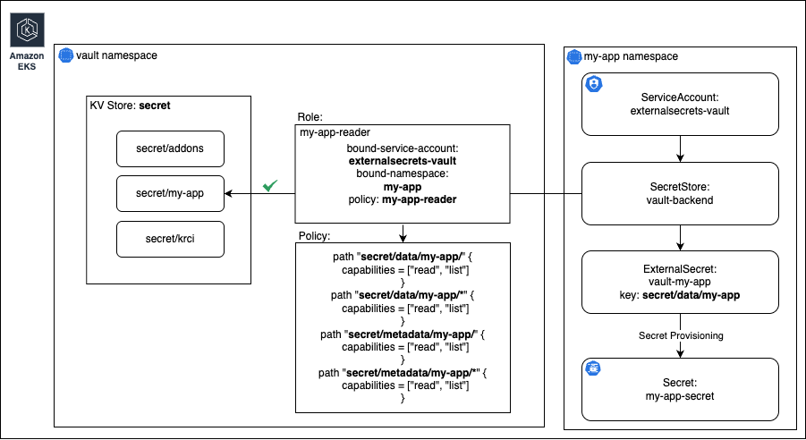
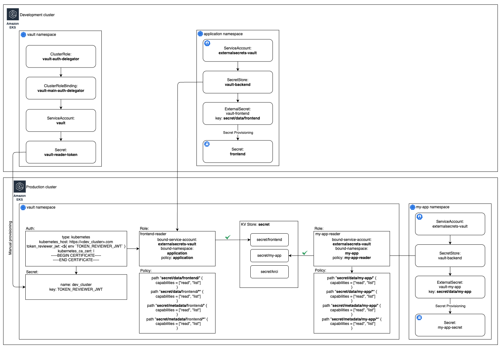

# vault-operator

  

A Helm chart for Vault Operator

This Helm chart deploys and configures HashiCorp Vault using the Bank-Vaults operator. The operator automatically manages the installation, configuration, and lifecycle of a Vault cluster in Kubernetes.

## Prerequisites

- Kubernetes cluster
- PostgreSQL database for Vault storage

## Configuration

The configuration consists of several key components that need to be set up for a fully functional Vault deployment:

### Database Connection

Vault requires a database backend for storage. This chart supports both internal and external PostgreSQL databases:

#### Default PostgreSQL Operator (PGO) Setup

By default, the chart is configured to use **Kubernetes PostgreSQL Operator (PGO)** which is enabled on [values.yaml](values.yaml#L92):

```yaml
vault:
  pgo:
    enabled: true
```

With PGO enabled, all database connection secrets are automatically configured and managed by the operator. No additional database configuration is required.

#### External Database Configuration

To use an external PostgreSQL database instead of PGO, you can configure the database connection parameters on [values.yaml](values.yaml#L80):

```yaml
vault:
  database:
    # Name of the secret with configuration
    secretName: vault-pguser-vault
    # Block for configuring secret's key
    hostKey: host
    portKey: port
    userKey: user
    passwordKey: password
    dbNameKey: dbname
```

When using an external database:

1. Create a Kubernetes secret containing the database connection details. You can create the secret using the command below:

  ```bash
  kubectl create secret generic vault-pguser-vault \
    --from-literal=host=<database-host> \
    --from-literal=port=<database-port> \
    --from-literal=user=<database-user> \
    --from-literal=password=<database-password> \
    --from-literal=dbname=<database-name> \
    --namespace=vault
  ```

2. Configure the secret name and key mappings in the `database` section.
3. Ensure the database is accessible from the Kubernetes cluster.
4. Consider disabling PGO by setting `pgo.enabled: false`.

### Secret Stores

Vault supports various types of [secret engines](https://developer.hashicorp.com/vault/docs/secrets) (stores) for different use cases. By default, when installing the operator, a KV v2 secret store named `secret` is automatically created. Additional stores can be added via [extraSecrets](values.yaml#L79) configuration:

```yaml
vault:
  extraSecrets:
    - path: "my-app-secrets"
      type: "kv"
      description: "Secrets for my application"
      options:
        version: 2
```

### Roles and Policies



*The diagram above illustrates the authentication process shown in the code examples below.*

Roles are configured through the [roles](values.yaml#L13) section. By default, when creating a role, a policy for read access to the specified store is automatically created.

#### Default Policy Generation

For each role defined in values.yaml, the operator automatically generates a policy that follows the [principle of least privilege](https://developer.hashicorp.com/vault/docs/concepts/policies#policy-syntax).

**Example role configuration:**
```yaml
vault:
  roles:
    - name: "my-app-reader"
      serviceAccount: "my-app"
      namespace: "my-namespace"
      path: "secret/data/my-app"
      extraPolicies: []
```

**This automatically generates the following Vault policy:**
```hcl
path "secret/data/my-app/" {
  capabilities = ["read", "list"]
}
path "secret/data/my-app/*" {
  capabilities = ["read", "list"]
}
path "secret/metadata/my-app/" {
  capabilities = ["read", "list"]
}
path "secret/metadata/my-app/*" {
  capabilities = ["read", "list"]
}
```

If additional security policies are needed, they can be added via [extraPolicies](values.yaml#L69):

```yaml
vault:
  extraPolicies:
    - name: "custom-app-policy"
      rules: |
        path "secret/data/my-app/*" {
          capabilities = ["create", "read", "update", "delete", "list"]
        }
```

**Why this approach:**
- **Security by design**: Each role only has access to its specific path in the KV store ([Vault Security Best Practices](https://developer.hashicorp.com/vault/tutorials/policies/policies))
- **KV v2 compatibility**: Includes both `data` and `metadata` paths required for KV v2 secret engine ([KV Secrets Engine v2](https://developer.hashicorp.com/vault/docs/secrets/kv/kv-v2))
- **Kubernetes integration**: Roles are bound to specific ServiceAccounts and namespaces ([Kubernetes Auth Method](https://developer.hashicorp.com/vault/docs/auth/kubernetes))

#### Adding Custom Policies

To add additional policies to a role, use the `extraPolicies` field:

```yaml
vault:
  roles:
    - name: "my-app-reader"
      serviceAccount: "my-app"
      namespace: "my-namespace"
      path: "secret/data/my-app"
      extraPolicies:
        - "custom-app-policy"  # Additional policy
        - "shared-resources"   # Another policy
```

## OIDC Integration with Keycloak

To enable OIDC authentication with Keycloak, [enable oidc](values.yaml#L68) and create a secret with the client secret:

```bash
kubectl create secret generic keycloak-client-vault-secret \
  --from-literal=clientSecret=<clientSecret> \
  --namespace=vault
```

Configure OIDC in values.yaml:

```yaml
vault:
  oidc:
    enabled: true
    issuer_url: "https://keycloak.example.com/realms/myrealm"
    discovery_url: "https://keycloak.example.com/realms/myrealm"
    clientSecret: "keycloak-client-vault-secret"
    groups:
      - name: "administrators"
        policies: ["vault-admin"]
      - name: "developers"
        policies: ["vault-ro"]
```

OIDC groups are specified in the `groups` block, where you can define which policies each group should have.

## Remote Cluster Integration

To add integration with a remote cluster for retrieving secrets from Vault, use the [remoteCluster](values.yaml#L34) block.



*The diagram above illustrates the authentication process for the remote cluster integration.*

### To prepare the remote cluster for using Vault, follow the steps below:

1. Install RBAC resources on the **remote cluster** (different from the cluster where Vault is running) where you want applications to retrieve secrets from Vault. Using the add-on approach ([KubeRocketCI Add-ons Guide](https://docs.kuberocketci.io/docs/operator-guide/add-ons-overview)), install the [vault-remote-rbac](../../../prod/addons/vault-remote-rbac) add-on on the target cluster. In this example, we're installing it on the production cluster.

2. Get the token from the created [ServiceAccount](../../../prod/addons/vault-remote-rbac/templates/remote_cluster_rbac/secret.yaml#4):

```bash
kubectl get secret <serviceaccount-token-secret> -o jsonpath='{.data.token}' | base64 -d
```

3. Create a secret with the token in the namespace where Vault is installed:

```bash
kubectl create secret generic <cluster_name> \
  --from-literal=TOKEN_REVIEWER_JWT="<token>" \
  --namespace=vault
```

### Configuration in values.yaml

To configure remote cluster integration, add the following configuration to the [values.yaml](values.yaml#L34) file in the `clusters/core/addons/vault-operator/` directory, below the `oidc` section:

```yaml
vault:
  remoteCluster:
    - name: "production-cluster"
      host: "https://prod-k8s-api.example.com"
      secretName: "<cluster_name>"  # Name of the created secret
      cert: |
        -----BEGIN CERTIFICATE-----
        <CA certificate of the remote cluster>
        -----END CERTIFICATE-----
      roles:
        - name: "prod-app-reader"
          serviceAccount: "my-app"
          namespace: "production"
          path: "secret/data/prod-app"
          extraPolicies: ""
```

After configuration, applications in the remote cluster will be able to authenticate with Vault and retrieve secrets using the Kubernetes auth method.

## Requirements

| Repository | Name | Version |
|------------|------|---------|
| oci://ghcr.io/bank-vaults/helm-charts | vault-operator | 1.23.0 |

## Values

| Key | Type | Default | Description |
|-----|------|---------|-------------|
| vault-operator.bankVaults.image.repository | string | `"ghcr.io/bank-vaults/bank-vaults"` | Bank-Vaults image repository. |
| vault-operator.bankVaults.image.tag | string | `"v1.32.0"` | Bank-Vaults image tag (pinned to supported Bank-Vaults version). |
| vault-operator.fullnameOverride | string | `""` | A name to substitute for the full names of resources. |
| vault-operator.image.bankVaultsRepository | string | `""` | Bank-Vaults image repository **Deprecated:** use `bankVaults.image.repository` instead. |
| vault-operator.image.bankVaultsTag | string | `""` | Bank-Vaults image tag **Deprecated:** use `bankVaults.image.tag` instead. |
| vault-operator.image.imagePullSecrets | list | `[]` | Reference to one or more secrets to be used when [pulling images](https://kubernetes.io/docs/tasks/configure-pod-container/pull-image-private-registry/#create-a-pod-that-uses-your-secret) (from private registries). (`global.imagePullSecrets` is also supported) |
| vault-operator.image.pullPolicy | string | `"IfNotPresent"` | [Image pull policy](https://kubernetes.io/docs/concepts/containers/images/#updating-images) for updating already existing images on a node. |
| vault-operator.image.repository | string | `"ghcr.io/bank-vaults/vault-operator"` | Name of the image repository to pull the container image from. |
| vault-operator.image.tag | string | `""` | Image tag override for the default value (chart appVersion). |
| vault-operator.nameOverride | string | `""` | A name in place of the chart name for `app:` labels. |
| vault-operator.pdb.create | bool | `true` | Create pod disruption budget if replicaCount > 1. |
| vault-operator.pdb.minAvailable | int | `1` | Min available for PDB. |
| vault-operator.replicaCount | int | `1` | Number of replicas (pods) to launch. |
| vault-operator.syncPeriod | string | `"5m"` |  |
| vault-operator.watchNamespace | string | `"vault"` | The namespace where the operator watches for vault CR objects. If not defined all namespaces are watched. |
| vault.bankVaultsContainer.image | string | `"ghcr.io/bank-vaults/bank-vaults"` |  |
| vault.bankVaultsContainer.tag | string | `"v1.32.0"` |  |
| vault.database.dbNameKey | string | `"dbname"` |  |
| vault.database.hostKey | string | `"host"` |  |
| vault.database.passwordKey | string | `"password"` |  |
| vault.database.portKey | string | `"port"` |  |
| vault.database.secretName | string | `"vault-pguser-vault"` |  |
| vault.database.userKey | string | `"user"` |  |
| vault.extraPolicies | list | `[]` |  |
| vault.extraSecrets[0].description | string | `"General secrets for krci-project and addons-project"` |  |
| vault.extraSecrets[0].options.version | int | `2` |  |
| vault.extraSecrets[0].path | string | `"secret"` |  |
| vault.extraSecrets[0].type | string | `"kv"` |  |
| vault.ingress.host | string | `"vault.core.kuberocketci.io"` |  |
| vault.oidc.clientSecret | string | `"keycloak-client-vault-secret"` |  |
| vault.oidc.client_id | string | `"vault"` |  |
| vault.oidc.discovery_url | string | `"https://keycloak.example.com/realms/<realm_name>"` |  |
| vault.oidc.enabled | bool | `false` |  |
| vault.oidc.groups[0].name | string | `"administrator"` |  |
| vault.oidc.groups[0].policies[0] | string | `"vault-admin"` |  |
| vault.oidc.groups[1].name | string | `"developer"` |  |
| vault.oidc.groups[1].policies[0] | string | `"vault-ro"` |  |
| vault.oidc.issuer_url | string | `"https://keycloak.example.com/realms/<realm_name>"` |  |
| vault.pgo.enabled | bool | `true` |  |
| vault.remoteCluster | list | `[]` |  |
| vault.replicaCount | int | `1` |  |
| vault.roles[0].extraPolicies | list | `[]` |  |
| vault.roles[0].name | string | `"krci-reader"` |  |
| vault.roles[0].namespace | string | `"krci"` |  |
| vault.roles[0].path | string | `"secret/data/krci"` |  |
| vault.roles[0].serviceAccount | string | `"externalsecrets-vault"` |  |
| vault.roles[1].extraPolicies | list | `[]` |  |
| vault.roles[1].name | string | `"nexus"` |  |
| vault.roles[1].namespace | string | `"nexus"` |  |
| vault.roles[1].path | string | `"secret/data/addons/nexus"` |  |
| vault.roles[1].serviceAccount | string | `"nexus"` |  |
| vault.roles[2].extraPolicies | list | `[]` |  |
| vault.roles[2].name | string | `"sonar"` |  |
| vault.roles[2].namespace | string | `"sonar"` |  |
| vault.roles[2].path | string | `"secret/data/addons/sonar"` |  |
| vault.roles[2].serviceAccount | string | `"sonar"` |  |
| vault.vaultContainer.image | string | `"hashicorp/vault"` |  |
| vault.vaultContainer.tag | string | `"1.15.2"` |  |
